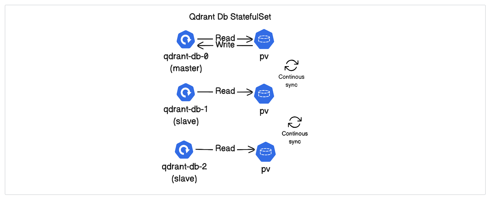
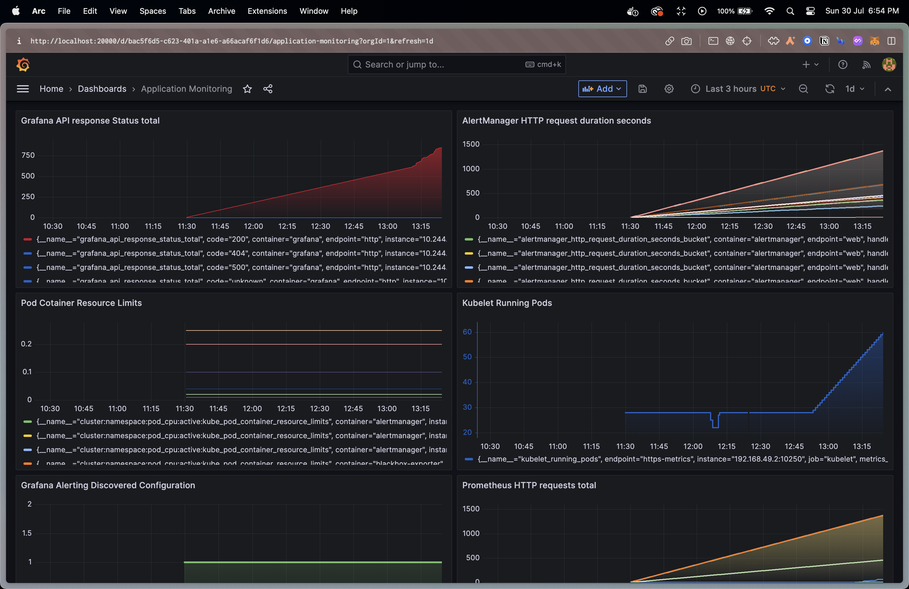
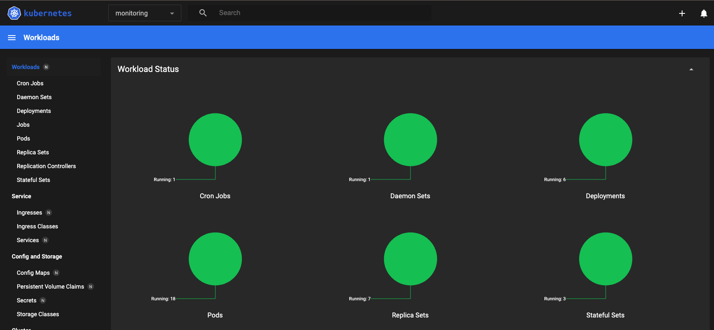

# Qdrant 

## Objective

The objectives of this task are as follows:
- [x] Create a highly scalable Qdrant vector database hosted on AWS.
- [x] Have automatic snapshotting and backup options available.
- [x] Have a recovery mechanism from backup for the database.
- [x] Develop an efficient mechanism to ingest around 1 million records in the database.
- [x] Set up observability and performance monitoring with alerts on the system. 
- [x] Use Terraform to spin up the required resources.

## Architecture Design


## Tech Stack

- `Go` 
- `Go Fiber` - Go Framework
- `Prometheus`
- `Grafana`
- `Qdrant` - Vector Database
- `Terraform` - Infra-structure as Code (IaC)
- `Aws` - Cloud Provider
- `Kube-Prometheus` deploys the Prometheus Operator and already schedules a Prometheus
called prometheus-k8s with alerts and rules by default.
- `Apache Kafka` - Distributed event streaming platform, It is used for creating Data Streaming Pipeline

## Setting up the Application using `docker-compose`

- To start the application in the local environment, execute the following command:

```bash
# for local enivronment
docker-compose up -d 
```
- If you want to deploy the application in a production environment, use the production-specific Docker Compose configuration file by executing the following command:
```bash
# for production environment
docker-compose -f docker-compose.prod.yaml up -d
```

## Setting up `kube-prometheus`

```bash
git clone --recursive https://github.com/prometheus-operator/kube-prometheus
cd kube-prometheus

kubectl create -f manifests/setup
until kubectl get servicemonitors --all-namespaces ; do date; sleep 1; echo ""; done
kubectl create -f manifests/ 

# or
./kube_prom.sh
```

## K8s Monitoring Pods
```bash
$ kubectl get all -n monitoring  
NAME                                       READY   STATUS    RESTARTS      AGE
pod/alertmanager-main-0                    2/2     Running   4 (17h ago)   29h
pod/alertmanager-main-1                    2/2     Running   4 (17h ago)   29h
pod/alertmanager-main-2                    2/2     Running   4 (17h ago)   29h
pod/blackbox-exporter-7d8c77d7b9-p4txc     3/3     Running   6 (17h ago)   29h
pod/grafana-79f47474f7-tsrpc               1/1     Running   2 (17h ago)   29h
pod/kube-state-metrics-8cc8f7df6-wslgq     3/3     Running   7 (86m ago)   29h
pod/node-exporter-bd97l                    2/2     Running   4 (17h ago)   29h
pod/prometheus-adapter-6b88dfd544-4rr57    1/1     Running   3 (86m ago)   29h
pod/prometheus-adapter-6b88dfd544-vhb98    1/1     Running   2 (17h ago)   29h
pod/prometheus-k8s-0                       2/2     Running   4 (17h ago)   29h
pod/prometheus-k8s-1                       2/2     Running   4 (17h ago)   29h
pod/prometheus-operator-557b4f4977-q76cz   2/2     Running   6 (86m ago)   29h
pod/qdapi-5fdb7df48b-cjfrz                 1/1     Running   0             31m
pod/qdapi-5fdb7df48b-s9l5x                 1/1     Running   0             31m
pod/qdapi-5fdb7df48b-wl82n                 1/1     Running   0             31m
pod/qdrant-db-0                            1/1     Running   0             44m
pod/qdrant-db-1                            1/1     Running   0             44m
pod/qdrant-db-2                            1/1     Running   0             44m

NAME                            TYPE        CLUSTER-IP       EXTERNAL-IP   PORT(S)                      AGE
service/alertmanager-main       ClusterIP   10.108.137.87    <none>        9093/TCP,8080/TCP            29h
service/alertmanager-operated   ClusterIP   None             <none>        9093/TCP,9094/TCP,9094/UDP   29h
service/blackbox-exporter       ClusterIP   10.103.243.118   <none>        9115/TCP,19115/TCP           29h
service/grafana                 ClusterIP   10.96.214.152    <none>        3000/TCP                     29h
service/kube-state-metrics      ClusterIP   None             <none>        8443/TCP,9443/TCP            29h
service/node-exporter           ClusterIP   None             <none>        9100/TCP                     29h
service/prometheus-adapter      ClusterIP   10.107.130.104   <none>        443/TCP                      29h
service/prometheus-k8s          ClusterIP   10.106.89.198    <none>        9090/TCP,8080/TCP            29h
service/prometheus-operated     ClusterIP   None             <none>        9090/TCP                     29h
service/prometheus-operator     ClusterIP   None             <none>        8443/TCP                     29h
service/qdapi                   ClusterIP   10.104.190.99    <none>        80/TCP                       45m
service/qdrant-db               ClusterIP   10.99.231.223    <none>        6333/TCP,6334/TCP            31m

NAME                           DESIRED   CURRENT   READY   UP-TO-DATE   AVAILABLE   NODE SELECTOR            AGE
daemonset.apps/node-exporter   1         1         1       1            1           kubernetes.io/os=linux   29h

NAME                                  READY   UP-TO-DATE   AVAILABLE   AGE
deployment.apps/blackbox-exporter     1/1     1            1           29h
deployment.apps/grafana               1/1     1            1           29h
deployment.apps/kube-state-metrics    1/1     1            1           29h
deployment.apps/prometheus-adapter    2/2     2            2           29h
deployment.apps/prometheus-operator   1/1     1            1           29h
deployment.apps/qdapi                 3/3     3            3           45m

NAME                                             DESIRED   CURRENT   READY   AGE
replicaset.apps/blackbox-exporter-7d8c77d7b9     1         1         1       29h
replicaset.apps/grafana-79f47474f7               1         1         1       29h
replicaset.apps/kube-state-metrics-8cc8f7df6     1         1         1       29h
replicaset.apps/prometheus-adapter-6b88dfd544    2         2         2       29h
replicaset.apps/prometheus-operator-557b4f4977   1         1         1       29h
replicaset.apps/qdapi-5fdb7df48b                 3         3         3       31m
replicaset.apps/qdapi-69d5bfcc99                 0         0         0       45m

NAME                                 READY   AGE
statefulset.apps/alertmanager-main   3/3     29h
statefulset.apps/prometheus-k8s      2/2     29h
statefulset.apps/qdrant-db           3/3     44m

NAME                           SCHEDULE    SUSPEND   ACTIVE   LAST SCHEDULE   AGE
cronjob.batch/qdrant-cronjob   0 0 * * *   False     0        <none>          4s
```


## For Recovery Mechanism in Database

In the StatefulSet configuration, I have used `volumeClaimTemplates` section to define the PVC template that will be used by each replica of the StatefulSet. Each replica will have its own PVC `PersistantVolumeClaim` with its unique identity, backed by the requested storage.

With this configuration, the Qdrant vector database instances will have their data persisted across restarts and rescheduling events, providing data durability and stability for your deployment.

- When using StatefulSets, you can request persistent storage using Persistent Volume Claims (PVCs). Each Pod in the StatefulSet can have its own PVC, which can be backed by a Persistent Volume (PV). The PVs are independent of the Pods and their lifecycle, so if a Pod fails, the PV and the data it holds will remain intact.

- In the case of a StatefulSet with a master-slave configuration, the master Pod is responsible for handling write operations to the data storage, while the slave Pods can read from the storage. This configuration ensures data consistency, as only one Pod is writing to the data at a time.



```yaml
apiVersion: apps/v1
kind: StatefulSet
metadata:
  name: qdrant-db
spec:
  selector:
    matchLabels:
      app: qdrant-db
  serviceName: qdrant-db
  replicas: 3
  template:
    metadata:
      labels:
        app: qdrant-db
    spec:
      containers:
      - name: qdrant-db
        image: qdrant/qdrant
        ports:
        - containerPort: 6333
          name: web
        - containerPort: 6334
          name: grpc        
        volumeMounts:
        - name: qdrant-data
          mountPath: /data
  volumeClaimTemplates:
  - metadata:
      name: qdrant-data
    spec:
      accessModes: [ "ReadWriteOnce" ]
        requests:
      resources:
          storage: 10Gi
```

## For automatic snapshotting and backup options

Kubernetes will generate a Job based on the schedule provided in the CronJob. The Job will run the container with the specified image at the scheduled time and take snapshots of the `qdrant-db`.

```yaml
apiVersion: batch/v1
kind: CronJob
metadata:
  name: qdrant-cronjob
spec:
  schedule: "0 0 * * *" # Run once a day at midnight
  jobTemplate:
    spec:
      template:
        spec:
          containers:
          - name: qdrant-db
            image: qdrant:qdrant
            imagePullPolicy: IfNotPresent
            ports:
            - containerPort: 6333
              name: web
            - containerPort: 6334
              name: grpc 
            volumeMounts:
            - name: qdrant-dump
              mountPath: /data
          restartPolicy: OnFailure
```

- @yearly (or @annually)	Run once a year at midnight of 1 January	`0 0 1 1 *`
- @monthly	Run once a month at midnight of the first day of the month	`0 0 1 * *`
- @weekly	Run once a week at midnight on Sunday morning	`0 0 * * 0`
- @daily (or @midnight)	Run once a day at midnight	`0 0 * * *`
- @hourly	Run once an hour at the beginning of the hour	`0 * * * *`

```bash
docker build --tag qdapi .
docker run -p 8000:8000 -e PORT=8000 -e QDRANT_ADDR=qdrant:6334 -d qdapi
```

## To run the Application using docker-compose
```bash
# production
docker-compose -f docker-compose.prod.yaml up -d 
# development
docker-compose up -d 
```


## Set up the port forwarding manually

```bash
kubectl --namespace monitoring port-forward svc/prometheus-k8s 10000:9090 >/dev/null &
kubectl --namespace monitoring port-forward svc/grafana 20000:3000 >/dev/null &
kubectl --namespace monitoring port-forward svc/alertmanager-main 30000:9093 >/dev/null & 
kubectl --namespace monitoring port-forward svc/qdapi 8080:80 >/dev/null &
kubectl --namespace monitoring port-forward svc/qdrant-db 6334:6334 >/dev/null &

# or 
# Use the provided script to automate port forwarding
./portforwarding.sh
```

### Accessing Services
Once the port forwarding is set up, you can access the following services on your local machine:

Grafana Dashboard: http://localhost:20000

Use this link to access the Grafana dashboard, where you can view various monitoring and analytics visualizations.
Application API: http://localhost:8080

Use this link to access the application's API, allowing you to interact with the application programmatically.
Prometheus Dashboard: http://localhost:10000

Use this link to access the Prometheus dashboard, where you can explore and monitor various metrics collected by Prometheus.

## To Run Terraform Code

### Setting up AWS Access

1. Create IAM User:
- Log in to the AWS Management Console using an account with administrative privileges.
- Navigate to the IAM service.
- Click on "Users" in the left navigation pane and create a new user.
- Add the user to a group with access to EC2. You can use an existing group with the `AmazonEC2FullAccess` policy attached, or create a custom group with the necessary EC2 permissions.
- Take note of the Access Key ID and Secret Access Key provided during the user creation process. You will need these to configure AWS CLI access.

2. Configure AWS CLI:
  - Open a terminal or command prompt on your local machine.
  - Run the following command and provide the Access Key ID and Secret Access Key when prompted:
     ```bash
     aws configure
     ```

### Running Terraform

1. Clone the Repository:
   - Clone the repository containing the Terraform code to your local machine using Git or download the code as a ZIP archive and extract it.

2. Navigate to the Terraform Configuration Folder:
   - Using the terminal or command prompt, navigate to the folder that contains the Terraform configuration files (e.g., `cd ./.terraform`).

3. Initialize Terraform:
   - Run the following command to initialize Terraform and download the necessary providers:
     ```bash
     terraform init
     ```

4. Plan the Terraform Deployment (Optional):
   - It's recommended to create a Terraform plan to preview the changes before applying them. Run the following command to generate a plan:
     ```
     terraform plan
     ```

5. Apply the Terraform Configuration:
   - If the plan looks good, apply the Terraform configuration to create the AWS EC2 instances. Run the following command and confirm the action:
     ```
     terraform apply
     ```

6. Verify the EC2 Instances:
   - Once the Terraform apply process is complete, log in to your AWS Management Console and navigate to the EC2 service. You should see the newly created EC2 instances.

### Cleaning Up

If you want to remove the resources created by Terraform, you can use the following command:

```
terraform destroy
```

## Grafana Dashboard 

- Screenshot of Grafana visualization dashboard.
- Tha `dashboard.yaml` file present in `grafana` directory 



## Minikube Dashboard

- Screenshot of Minikube dashboard visualization.



## API Documentation

- Get All the Collection Created
  ```js
  GET {{ baseURL }}/all
  ```

- Create Collection
  ```js
  POST {{ baseURL }}/all
  ```
  ```json
  {
      "collectionName": "test_collection"
  }
  ```
- Create Field Inside Collection
  ```js
  POST {{ baseURL }}/field/create
  ```
  ```json
  {
      "collectionName": "test_collection",
      "fieldName": "location"
  }
  ```

- Insert Data into Collection
  ```js
  POST {{ baseURL }}/upsert
  ```
  ```json
  {
      "id": 2,
      "city": "New York",
      "location": "Washington DC",
      "collectionName": "test_collection"
  }
  ```
- Get Data by Id
  ```js
  POST {{ baseURL }}/data/id
  ```
  ```json
  {
      "id": 2,
      "collectionName": "test_collection"
  }
  ```
- DeleteCollection
  ```js
  DELETE {{ baseURL }}/collection/delete
  ```
  ```json
  {
      "collectionName": "test_collection"
  }
  ```

## Setting up the Data Pipeline


### For the Consumer
To set up the Kafka consumer, follow these steps:

1. Open a terminal or command prompt.
2. Navigate to the `kafka_consumer` directory using the `cd` command:
   ```bash
   cd kafka_consumer
   ```
3. Build the consumer using the following command:
   ```bash
   go build -o out/consumer utils.go consumer.go
   ```
   This command will compile the code and generate the executable file named `consumer` inside the `out` directory.

### For the Producer
To set up the Kafka producer, follow these steps:

1. Open a terminal or command prompt.
2. Navigate to the `kafka_producer` directory using the `cd` command:
   ```bash
   cd kafka_producer
   ```
3. Build the producer using the following command:
   ```bash
   go build -o out/producer utils.go producer.go
   ```
   This command will compile the code and generate the executable file named `producer` inside the `out` directory.

### Modifying Data Consumption

By default, the data consumption value is set to 10,000 (10K) records in the `kafka_producer/producer.go` file. You can modify this value to any desired number, such as 1 million (1M), by following these steps:

1. Open the `kafka_producer/producer.go` file in a text editor or code editor of your choice.
2. Locate the following section of code within the `producer.go` file:

- Currently the Cosumption value is set to 10K, it can be modified to 1Mil in `kafka_producer/producer.go` file. 

```go
for n := 0; n < 10000; n++ {
    key := users[rand.Intn(len(users))]
    payload := Payload{
        ID:             n + 1,
        City:           key,
        Location:       "Spain",
        CollectionName: "test_collection",
    }
    .
    .
    .
}
```
3. Update the loop condition `10000` to your desired value. For example, to generate 1 million records, change it to `1000000`.
4. Save the changes to the file.

With this modification, the Kafka producer will now generate the specified number of records when executed.
